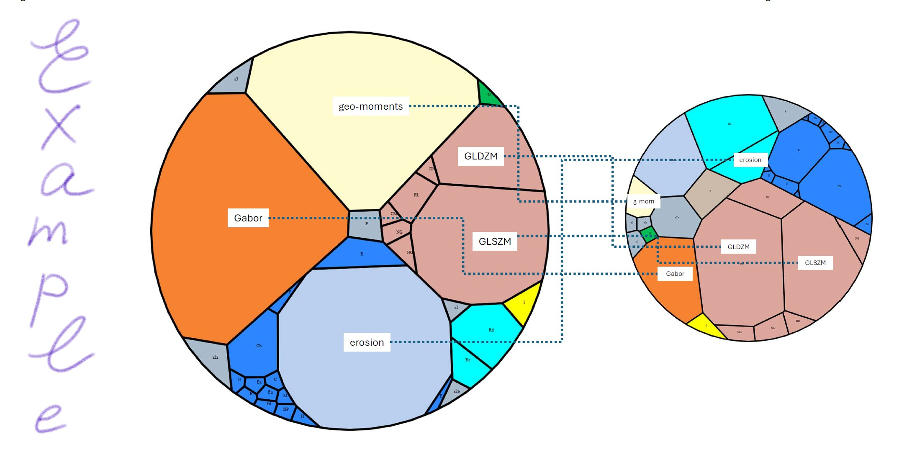

# Compute cost GPU vs non-GPU



Steps:

(1) clone the renderer from github.com/friskluft/vhrend <br>
(2) assuming a benchmark is in file /work/benchmark1.csv <br>
(3) compile renderer's scripts
```r
source ("vthie_df_2_tree.r")
source ("vthie_render.r")
```
(3) produce an graphics html-file from a benchmarks csv-file using the following command
```r
vthie_render(
	datafname="/work/benchmark1.csv", 
	outfname="/work/benchmark1.html")
```


(4) using a browser, open file /work/benchmark1.html <br>
(5) print it to a PDF <br>
(6) use the PDF file as a graphics file in PowerPoint or LaTeX to prepare a figure (clip the PDF-provided graphics, add callouts, etc.) <br>


