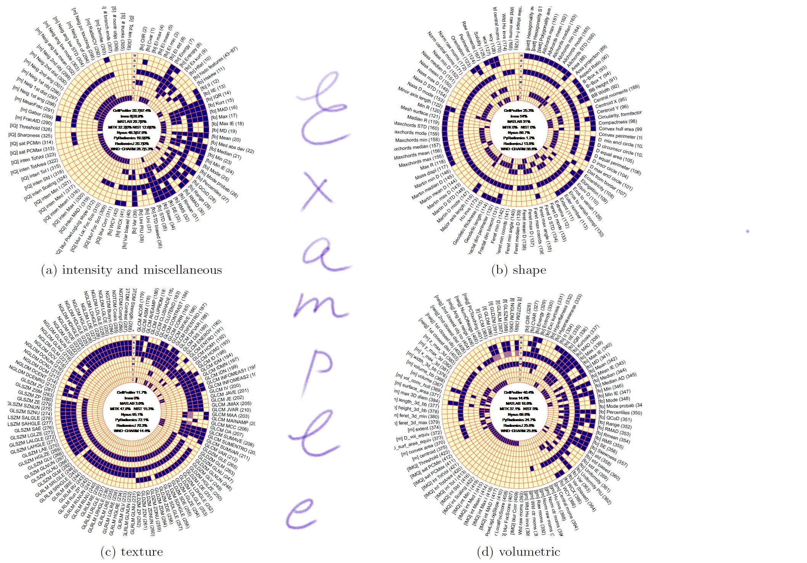

# Comparison of feature sets




## Workflow:

The goal is to use the polar heatmap renderer in github.com/friskluft/polarheat to produce the 4 PDF-files referenced by the manuscript as sub-figures by transforming corresponding CSV-based definition files: 

<table>
<tr>
	<td align='center' valign='middle'>role</td> 
	<td align='center' valign='middle'>PDF (output, result)</td> 
	<td align='center' valign='middle'>CSV (source)</td>
</tr>
<tr>
	<td>intensity and misc. features</td> 
	<td>feature_corr_intenandmisc_polar_raw</td>
	<td>correlated_inten_and_misc</td>
</tr>
<tr>
	<td>shape features</td> 
	<td>feature_corr_shape_polar_raw</td> 
	<td>correlated_shape_111-000</td>
</tr>
<tr>
	<td>texture features</td> 
	<td>feature_corr_texture_polar_raw</td> 
	<td>correlated_texture_111-000</td>
</tr>
<tr>
	<td>volumetric features</td> 
	<td>feature_corr_3d_polar_raw</td> 
	<td>correlated_3d2</td>
</tr>
</table>

Steps: <br>
(1) clone github.com/friskluft/polarheat <br>
(2) compile the renderer
```r
source("polarheat.r")
```

(3) produce each sub-figure y.pdf from x.csv by
```r
polarheat(
	fname="x.csv", 
	outFname="y.pdf", 
	LANE_COLUMNS = c("Cellprofiler","Imea","MATLAB","MITK","NIST","Nyxus","PyRadiomics","RadiomicsJ","WC"),
	LANE_LBLS = c("1","2","3","4","5","6","7","8","9"),
	HOLE_TEXT = "1 CellProfiler %4.2f%%\n2 Imea %4.2f%%\n3 MATLAB %4.2f%%\n4 MITK %4.2f%%   5 NIST %4.2f%%\n6 Nyxus %4.2f%%\n7 PyRadiomics %4.2f%%\n8 RadiomicsJ %4.2f%%\n9 WND-CHARM %4.2f%%")
```
For example, the volumetric PDF can be produced with the following command:
```r
polarheat(
	fname="/manuscript/grafix/correlated_3d2.csv", 
	outFname="/manuscript/grafixfeature_corr_3d_polar_raw.pdf",
	LANE_COLUMNS = c("Cellprofiler","Imea","MATLAB","MITK","NIST","Nyxus","PyRadiomics","RadiomicsJ","WC"),
	LANE_LBLS = c("1","2","3","4","5","6","7","8","9"),
	HOLE_TEXT = "1 CellProfiler %4.2f%%\n2 Imea %4.2f%%\n3 MATLAB %4.2f%%\n4 MITK %4.2f%%   5 NIST %4.2f%%\n6 Nyxus %4.2f%%\n7 PyRadiomics %4.2f%%\n8 RadiomicsJ %4.2f%%\n9 WND-CHARM %4.2f%%")
```

